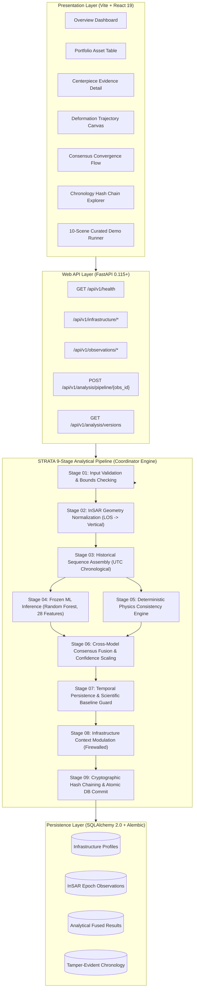

# STRATA — Structural Temporal Analysis & Threat Assessment

> **A Multi-Source Analytical Evidence Fusion and Tamper-Evident Chronology Framework for Satellite InSAR Infrastructure Monitoring**

[](#18-system-version-registry)
[](#17-installation--reproducibility)
[](#17-installation--reproducibility)
[](#14-database--api-architecture)
[](#15-frontend-presentation-layer)
[](#3-important-scientific-boundaries)

---

## 1. Overview

**STRATA** (**S**tructural **T**emporal **A**nalysis & **T**hreat **A**ssessment) is a research-oriented infrastructure monitoring platform for civil assets (bridges, dams, tunnels, viaducts, embankments, and retaining walls) using multi-epoch spaceborne Interferometric Synthetic Aperture Radar (InSAR) observations.

The core design principle of STRATA is that **no single analytical model, isolated machine learning classifier, or static heuristic threshold establishes structural threat**. Instead, STRATA cross-examines multi-epoch radar observations through two independent, decoupled analytical engines:
1. A **learned statistical deformation classifier** that evaluates spatiotemporal feature distributions.
2. A **deterministic physical InSAR consistency engine** that enforces kinematic velocity bounds, noise floors, and interferometric coherence limits.

STRATA dynamically modulates analytical confidence based on cross-model agreement or divergence, applies longitudinal temporal state transitions with a false-alarm acceleration guard, contextualizes findings against engineering profiles under a strict ground-truth leakage firewall, and cryptographically records every analytical epoch in an immutable SHA-256 evidence chronicle.

---

## 2. The Core Scientific Problem

Civil infrastructure assets deteriorate over decades due to cyclic mechanical loading, ground settlement, thermal stress, and material fatigue. While spaceborne InSAR provides millimeter-scale surface displacement observations across vast transportation and utility corridors, practical civil engineering adoption has been hindered by severe observational ambiguities:
* **Atmospheric Phase Screen (APS) Delay**: Stratified and turbulent tropospheric water vapor variations induce localized radar phase delays that mimic acute, sudden displacement steps.
* **Seasonal Thermal Expansion**: Cyclic, reversible elastic breathing of steel and concrete spans ($3 - 10\text{ mm}$ annual amplitude) is frequently mischaracterized by static thresholding as progressive structural settlement.
* **Temporal & Spatial Decorrelation**: Agricultural growth, surface moisture, and vegetation cause severe interferometric phase decorrelation ($|\gamma| < 0.40$), generating high-variance phase noise that masquerades as rapid kinematic distress.
* **Short-Baseline Mathematical Artifacts**: Polynomial fitting across short observation windows ($\le 60\text{ days}$) mathematically produces non-zero second derivatives (apparent acceleration in $\text{mm/year}^2$) on stable physical structures.
* **Uncalibrated Model Drift**: Isolated machine learning classifiers experience out-of-domain false positives when encountering novel sensor geometries or unmodeled noise patterns.

### The Central STRATA Interaction Mechanism

STRATA resolves these ambiguities through a multi-stage evidence fusion hierarchy:

```text
                  Multi-Epoch Satellite InSAR Observations
                                     │
                 ┌───────────────────┴───────────────────┐
                 ▼                                       ▼
    [ Learned Deformation Classifier ]     [ Deterministic Physics Engine ]
    • 28 Observable Features               • Kinematic Velocity Bounds
    • Spatiotemporal Pattern Recognition   • Coherence Quality Gating
    • Class Probability Distribution       • Admissibility Verification
                 │                                       │
                 └───────────────────┬───────────────────┘
                                     ▼
                      [ Cross-Model Consensus Fusion ]
                      • Agreement   -> Elevates Analytical Confidence
                      • Divergence  -> Penalizes Confidence & Flags CONFLICTED
                      • Reversible  -> Classifies Environmental Pattern
                                     │
                                     ▼
                      [ Longitudinal Temporal Kinematics ]
                      • Multi-Epoch Persistence Tracking
                      • Scientific Baseline Guard (Suppresses False Acceleration)
                      • Environmental Recurrence Guard
                                     │
                                     ▼
                      [ Context-Aware Asset Characterization ]
                      • Material, Criticality & Critical Zones Sensitivity
                      • Historical Baseline Deviation (Normalized z-Score)
                      • Strict Ground-Truth Leakage Firewall
                                     │
                                     ▼
                      [ Evidence Characterization Index ]
                      • Index (0 - 100) + Analytical Confidence (%)
                      • Objective Inspection Prioritization Metric
                                     │
                                     ▼
                      [ Tamper-Evident Evidence Chronology ]
                      • Canonical JSON SHA-256 Hash Chaining
                      • Immutable Provenance & Post-Hoc Audit Trail
```

---

## 3. Important Scientific Boundaries

To preserve research integrity and prevent misleading representations, STRATA enforces clear operational boundaries:

### What STRATA Does:
* Ingests and normalizes multi-epoch satellite InSAR Line-of-Sight (LOS) observations into verticalized displacements.
* Evaluates learned statistical deformation patterns using a calibrated, feature-frozen machine learning model.
* Verifies physical radar consistency and kinematic admissibility through deterministic closed-form physics rules.
* Symmetrically cross-examines analytical interpretations to modulate confidence and penalize cross-model conflicts.
* Accumulates evidence longitudinally across time to distinguish transient noise from persistent deformation.
* Disables false acceleration assertions on nominal assets using a Scientific Baseline Guard.
* Applies civil asset contextual sensitivity under a strict programmatic ground-truth firewall.
* Formats an objective **Evidence Characterization Index** ($0 - 100$) for structural inspection crew dispatch prioritization.
* Preserves complete, verifiable analytical provenance in an immutable SHA-256 hash chain.

### What STRATA Does NOT Do:
* **Does NOT certify structural safety** or issue civil engineering safety sign-offs.
* **Does NOT predict structural collapse** or forecast imminent failure events.
* **Does NOT compute material failure probabilities** or structural reliability indices ($P_f$).
* **Does NOT estimate remaining fatigue life** or remaining useful life (RUL) in operational years.
* **Does NOT replace certified physical engineering inspections** or destructive structural health testing.
* **Does NOT assert operational real-world validation** from the current literature-calibrated synthetic case-study datasets.

> **Mandatory Scientific Notice**:  
> *Experimental prototype index — not a failure probability, remaining-life estimate, structural safety rating, or engineering certification.*

---

## 4. System Architecture



---

## 5. The 9-Stage End-to-End Analytical Pipeline

Each satellite acquisition epoch triggers atomic, deterministic execution across 9 discrete pipeline stages:

| Stage | Subsystem Module | Functional Purpose | Inputs & Outputs | Safeguards & Invariants |
|:---|:---|:---|:---|:---|
| **01** | `insar.validator` | Sanity checking raw satellite telemetry. | **In**: Raw InSAR observation payload.<br>**Out**: Validated numerical record. | Validates non-NaN displacement ($\pm 10,000\text{ mm}$), valid coherence ($\gamma \in [0.0, 1.0]$), and incidence angle ($\theta \in [0^\circ, 90^\circ]$). |
| **02** | `insar.normalizer` | Projects Line-of-Sight (LOS) phase to vertical displacement. | **In**: LOS mm, look angle $\theta$.<br>**Out**: Verticalized mm, geometry flags. | Enforces $d_{\text{vert}} = d_{\text{LOS}} / \cos\theta$. Flags missing orbit geometry; preserves raw LOS without corruption. |
| **03** | `pipeline.coordinator` | Assembles historical observation trajectory. | **In**: Asset UUID, current epoch timestamp.<br>**Out**: Monotonically sorted historical sequence. | Enforces strict chronological UTC ordering ($t_1 < t_2 < \dots < t_N$); eliminates duplicate epochs and validates temporal baselines. |
| **04** | `ml.classifier` | Statistical multi-class deformation inference. | **In**: 28-dimensional observable feature vector.<br>**Out**: Class probabilities, predicted class, entropy. | Strict feature allowlist enforcement. Programmatic firewall blocks ground truth labels and asset metadata from feature extraction. |
| **05** | `physics.engine` | Deterministic radar kinematic consistency. | **In**: Multi-epoch displacement and coherence series.<br>**Out**: Physical consistency score, kinematic state. | Enforces physical velocity bounds ($|v| \le 35\text{ mm/yr}$), coherence thresholds ($\gamma \ge 0.40$), and acceleration gates. |
| **06** | `consensus.engine` | Fuses learned and deterministic physical evidence. | **In**: ML distribution, physics evaluation.<br>**Out**: Fused category, modulated confidence, conflict flag. | Symmetrical confidence modulation: agreement strengthens confidence; disagreement applies penalties and forces `CONFLICTED`. |
| **07** | `temporal.engine` | Evaluates multi-pass kinematic persistence. | **In**: Chronological consensus history.<br>**Out**: Temporal status, streak, supported acceleration. | **Scientific Baseline Guard**: Suppresses acceleration assertions if sequence duration $\le 60\text{ days}$ or displacement is within baseline noise. |
| **08** | `risk.engine` | Computes asset Evidence Characterization Index. | **In**: Temporal state, asset profile, critical zones.<br>**Out**: Evidence Characterization Index ($0-100$). | **Ground-Truth Firewall**: Asset criticality cannot override low coherence. Deviation expressed as normalized $z$-score without medical survival analogies. |
| **09** | `chronology.engine` | Cryptographic evidence provenance chaining. | **In**: Canonical JSON execution snapshot.<br>**Out**: SHA-256 chained audit record. | Atomic database transaction: failure at any stage rolls back the entire pipeline; zero orphan state; idempotent replay caching. |

---

## 6. InSAR & Physics Consistency Engine

The deterministic physics engine evaluates radar interferometry observations against established physical kinematic laws without machine learning inference.

### 6.1 Measurement Quality & Noise Floors
* **Interferometric Coherence ($\gamma$)**: Measures radar phase correlation between radar passes ($0 \le \gamma \le 1$). If mean coherence drops below $0.40$, data is classified as `LOW_QUALITY` or `INSUFFICIENT_EVIDENCE`.
* **Empirical Noise Floor**: Civil assets maintain an empirical baseline standard deviation ($\sigma_{\text{baseline}}$, typically $\pm 1.2\text{ mm}$ for C-Band radar). Displacements within $\pm 1\sigma$ are treated as nominal stationary noise.

### 6.2 Radar Viewing Geometry & LOS Decomposition
Satellite radar sensors observe one-dimensional phase change along the radar Line-of-Sight (LOS) vector. For predominantly vertical structural deformation (settlement or uplift), STRATA converts LOS displacement ($d_{\text{LOS}}$) to vertical displacement ($d_{\text{vertical}}$) using the verified radar incidence angle ($\theta$):

$$d_{\text{vertical}} = \frac{d_{\text{LOS}}}{\cos\theta}$$

**Geometry Assumptions & Limitations**: This single-track conversion assumes horizontal east-west and north-south deformation components are negligible. Full 3D vector decomposition requires combining ascending and descending satellite passes.

### 6.3 Kinematic Analysis & The Scientific Baseline Guard
* **Velocity Admissibility**: Enforces maximum physical velocity bounds for civil assets ($|v| \le 35\text{ mm/year}$ nominal threshold). Unphysical displacement jumps exceeding radar phase-wrapping limits are classified as `TEMPORALLY_INCONSISTENT`.
* **Apparent vs. Supported Acceleration**:
  * *Apparent Acceleration*: Second-order polynomial curvature ($\text{mm/year}^2$) is computed across time-series epochs.
  * *Supported Acceleration Guard*: Mathematically non-zero curvature is **suppressed** (`acceleration_supported = FALSE`) if:
    1. Total sequence observation duration is $\le 60\text{ days}$; OR
    2. Net displacement oscillations remain within the asset's nominal $\pm 1\sigma$ historical baseline noise envelope.
  * *Scientific Rationale*: Short temporal windows and baseline sensor noise naturally yield non-zero polynomial coefficients. The baseline guard prevents false runaway alarm triggers on nominal bridges and viaducts.

### 6.4 Environmental & Atmospheric Discrimination
* **Atmospheric Phase Screen Identification**: Tropospheric water vapor turbulence causes localized transient spikes. If a displacement spike at epoch $t_k$ immediately reverts to baseline at epoch $t_{k+1}$ without directional persistence, it is classified as an `ATMOSPHERIC_EVENT`.
* **Environmental Recurrence Guard**: Correlates multi-epoch displacement against seasonal ambient temperature cycles. If cyclic sinusoidal correlation exceeds $r > 0.65$ with zero net multi-year trend, the asset is classified as `ENVIRONMENTAL_PATTERN` (cyclic reversible thermal breathing), suppressing false structural settlement alerts.

---

## 7. Machine Learning Deformation Classifier

The machine learning subsystem provides learned statistical pattern recognition across spatiotemporal deformation sequences.

### 7.1 Model Architecture & Frozen Specification
* **Classifier Type**: Scikit-Learn `RandomForestClassifier` (100 estimators, maximum tree depth 12, balanced class weighting).
* **Random Seed**: `42` (Deterministic initialization).
* **Model Version**: `0.1.0` (Feature-frozen).
* **Calibration**: Probability calibration evaluated using Platt scaling / isotonic regression on held-out validation sequences.

### 7.2 The 28 Observable Features Allowlist
Feature extraction processes only physical InSAR telemetry, enforcing strict separation from ground truth via a programmatic firewall:

| Feature Group | Count | Extracted Feature Names |
|:---|:---:|:---|
| **Group A: Quality** | 6 | `coherence_mean`, `coherence_std`, `minimum_coherence`, `phase_quality_mean`, `phase_quality_std`, `noise_estimate_mean_mm` |
| **Group B: Displacement** | 7 | `mean_displacement_mm`, `displacement_std_mm`, `displacement_range_mm`, `displacement_to_noise_ratio`, `mean_absolute_step_mm`, `max_absolute_step_mm`, `max_step_to_range_ratio` |
| **Group C: Temporal Kinematics** | 7 | `slope_mm_per_year`, `linear_fit_residual_std_mm`, `acceleration_mm_per_year2`, `quadratic_fit_residual_std_mm`, `directional_consistency`, `sign_change_count`, `temporal_autocorrelation_lag1` |
| **Group D: Periodicity** | 2 | `zero_crossing_count`, `approximate_periodicity_indicator` |
| **Group E: Geometry** | 6 | `epoch_count`, `duration_days`, `temporal_spacing_mean_days`, `temporal_spacing_std_days`, `incidence_angle_mean_deg`, `incidence_angle_std_deg` |
| **Total Features** | **28** | **Full deterministic observable feature vector** |

**Ground-Truth Leakage Firewall**: Forbidden columns (`true_structural_displacement_mm`, `true_environmental_displacement_mm`, `ground_truth_class`, `scenario`, `random_seed`, `parameters`, `physics_classification`) are strictly rejected by runtime validation checks.

### 7.3 Verified Machine Learning Results
Evaluated strictly on the **unseen held-out test set ($N=525$ sequences, representing 15% of the 3,500 controlled synthetic dataset)**:

| Metric | Measured Value | Scientific Meaning |
|:---|:---:|:---|
| **Overall Accuracy** | **72.19%** | Correct classification across 7 highly ambiguous multi-class physical modes. |
| **Macro Precision** | **72.27%** | Balanced positive predictive value across all classes without majority bias. |
| **Macro Recall** | **72.19%** | Uniform detection sensitivity across structural and environmental classes. |
| **Macro F1-Score** | **0.7180** | Harmonic mean of precision and recall across all deformation modes. |
| **Brier Multi-Class Score** | **0.3529** | Low mean squared probability calibration error. |
| **Cross-Entropy Log Loss** | **0.7143** | Well-calibrated class probability distributions. |
| **Macro ROC-AUC (OvR)** | **0.9392** | High separation capability across varying probability decision thresholds. |

*Scientific Interpretation*: The model outputs class probabilities over deformation modes. These values reflect statistical class confidence within the synthetic distribution; they are **not** probabilities of physical structural failure.

---

## 8. Controlled Synthetic Dataset

To establish benchmark reproducibility, STRATA evaluated a controlled 3,500-sequence synthetic InSAR dataset:
* **Total Sequences**: 3,500 multi-epoch time series ($N=500$ sequences per class).
* **Dataset Partition**: Stratified 70% Train (2,450), 15% Validation (525), 15% Held-Out Test (525).
* **Random Initialization**: Fixed deterministic generation seed `42`.
* **7 Kinematic Ground-Truth Classes**:
  1. `STABLE`: Nominal asset subject to sub-millimeter Gaussian radar noise ($\sigma = 1.0\text{ mm}$).
  2. `SEASONAL_ENVIRONMENTAL`: Sinusoidal thermal breathing ($3 - 8\text{ mm}$ amplitude) correlated with temperature cycles.
  3. `STRUCTURAL_MONOTONIC`: Constant-velocity progressive subsidence or uplift ($-5$ to $-25\text{ mm/year}$).
  4. `STRUCTURAL_ACCELERATING`: Second-order non-linear kinematic acceleration ($> 15\text{ mm/year}^2$).
  5. `ATMOSPHERIC_TRANSIENT`: Nominal baseline contaminated by acute, non-persistent tropospheric phase screen delay ($\pm 14.5\text{ mm}$).
  6. `LOW_QUALITY`: Severe phase decorrelation noise ($|\gamma| < 0.35$) causing high phase variance.
  7. `TEMPORALLY_INCONSISTENT`: Erratic, non-physical phase jumps and wrapping artifacts.

> **Dataset Limitation**: The benchmark is controlled synthetic data. While literature-calibrated against published InSAR noise parameters, it should not be construed as equivalent to uncurated raw satellite SAR scenes.

---

## 9. Physics Consistency Diagnostic Benchmark

To determine the necessity of dual-engine fusion, the deterministic physics consistency engine was independently benchmarked as a standalone classifier on the exact same 525-sequence held-out test set:

* **Diagnostic Benchmark Accuracy**: **40.95%** across the 7 synthetic classes.
* **Scientific Significance**:
  * The physics engine achieved near $100\%$ precision on identifying `LOW_QUALITY` decorrelation (coherence gating) and `STABLE` baselines (noise bounds).
  * However, standalone deterministic physics struggled to separate non-linear structural degradation from partial seasonal thermal cycles, deliberately classifying ambiguous sequences as "unverified".
  * This benchmark confirms that **deterministic physics rules alone cannot reliably classify civil InSAR deformation**, demonstrating why consensus fusion with statistical machine learning is essential.

---

## 10. Cross-Model Consensus Engine

The Consensus Engine cross-examines the independent outputs of the ML classifier and the deterministic physics engine.

### 10.1 Symmetrical Confidence Modulation Principle
* **Concurrence**: When ML and physics agree (e.g., ML predicts structural deformation and physics verifies velocity admissibility and coherence), fused analytical confidence is elevated:

$$\text{Confidence}_{\text{fused}} = \min(1.0, \, \text{Confidence}_{\text{base}} \times 1.15)$$

* **Divergence**: When ML and physics conflict (e.g., ML predicts structural settlement but physics detects transient atmospheric spike characteristics), fused confidence is penalized and the state is flagged:

$$\text{Confidence}_{\text{fused}} = \text{Confidence}_{\text{base}} \times 0.70$$

### 10.2 Consensus Decision Categories
1. `STRUCTURAL`: Both engines confirm kinematic deformation exceeding noise thresholds.
2. `ENVIRONMENTAL`: Signatures match cyclic seasonal thermal breathing.
3. `ATMOSPHERIC`: Isolated phase screen transient without temporal persistence.
4. `LOW_QUALITY`: Low interferometric coherence ($\gamma < 0.40$).
5. `CONFLICTED`: ML and physics diverge, triggering manual engineering inspection flags.
6. `INSUFFICIENT_EVIDENCE`: Baseline observations insufficient for characterization.
7. `STABLE`: Observations oscillate within historical baseline noise floor ($\pm 1\sigma$).

---

## 11. Longitudinal Temporal Evidence Engine

STRATA tracks evidence accumulation across time using a discrete finite state machine:

```text
       ┌────────────────────────┐
       │  INSUFFICIENT_HISTORY  │ (Observations < 3 epochs)
       └───────────┬────────────┘
                   ▼
       ┌────────────────────────┐
       │        BASELINE        │ (Oscillations within ±1σ noise floor)
       └───────────┬────────────┘
                   │  (Displacement exceeds baseline noise)
                   ▼
       ┌────────────────────────┐
       │        EMERGING        │ (Streak < persistence threshold)
       └───────────┬────────────┘
                   │  (Persistent directional displacement >= 3 epochs)
                   ▼
       ┌────────────────────────┐
       │       PERSISTENT       │ ──► [ Scientific Baseline Guard: Acceleration Check ]
       └────────────────────────┘
```

* **Temporal States**: `INSUFFICIENT_HISTORY`, `BASELINE`, `EMERGING`, `PERSISTENT`, `REVERTED`, `ENVIRONMENTAL_PATTERN`, `ATMOSPHERIC_EVENT`, `CONFLICTED`, `LOW_QUALITY`.
* **Streak & Persistence**: Structural characterization requires directional persistence across at least 3 consecutive satellite passes (36 days on a 12-day Sentinel-1 revisit cycle).

---

## 12. Infrastructure-Specific Risk Characterization

The risk characterization layer translates fused multi-epoch evidence into an interpretable **Evidence Characterization Index**:

* **Engineering Profiles**: Incorporates structure type (Bridge, Dam, Tunnel, Building, Embankment, Retaining Wall), construction material (Concrete, Steel, Masonry, Earth, Rock, Composite), and criticality tier (`LOW`, `MODERATE`, `HIGH`, `CRITICAL`).
* **Ground-Truth Leakage Firewall**: Structural criticality cannot override low measurement quality. If coherence is degraded ($\gamma < 0.40$), the index remains strictly low, emitting an `INSUFFICIENT_EVIDENCE` notification.
* **Baseline Normalization**: Baseline deviation is computed as a normalized standard deviation ($z$-score), strictly avoiding medical survival analogies:

$$z = \frac{|d_{\text{current}} - \mu_{\text{baseline}}|}{\sigma_{\text{baseline}}}$$

* **Evidence Characterization Index ($0 - 100$)**:
  * $0.0 - 19.9$: `BASELINE` (Nominal stationary behavior).
  * $20.0 - 49.9$: `MONITOR` (Evidence of displacement or cross-model conflict).
  * $50.0 - 74.9$: `ELEVATED_ATTENTION` (Persistent deformation on critical assets).
  * $75.0 - 100.0$: `HIGH_ATTENTION` (High-confidence persistent multi-epoch deformation).

---

## 13. Tamper-Evident Evidence Chronology

STRATA guarantees analytical auditability by maintaining an immutable SHA-256 evidence chain:

```text
[ Observation Block #001 ] ──► SHA-256 Hash Link ──► [ Observation Block #002 ] ──► SHA-256 Link
       │                                                     │
       ├─ Sequence: 1                                        ├─ Sequence: 2
       ├─ Timestamp: UTC                                     ├─ Prev Hash: hash_001
       ├─ Analysis State: BASELINE                           ├─ Analysis State: PERSISTENT
       └─ Hash: hash_001                                     └─ Hash: hash_002
```

* **Canonical JSON Serialization**: Eliminates floating-point whitespace and key-order nondeterminism (`sort_keys=True`, float precision locked to 6 decimal places).
* **Hash Chaining**: Each record calculates:

```text
current_hash = SHA256(previous_hash || canonical_payload_hash)
```

$$h_i = \operatorname{SHA-256}(h_{i-1} \parallel h_{\text{payload}, i})$$

* **Tamper Detection**: **10 / 10** simulated adversarial tamper vectors (record deletion, retroactive displacement alteration, hash insertion, timestamp modification) are detected and rejected.
* **Integrity Limitation**: The hash chain provides cryptographic tamper evidence; it does not replace off-site cold storage or prevent a root database administrator from recomputing an entire chain from genesis.

---

## 14. Database & API Architecture

STRATA provides a production-grade REST API built on FastAPI 0.115+ and SQLAlchemy 2.0 with PostgreSQL/SQLite compatibility.

### Verified API Endpoints

| HTTP Method | API Path | Functional Description |
|:---|:---|:---|
| `GET` | `/api/v1/health` | System health check, service name, and version confirmation. |
| `POST` | `/api/v1/infrastructure` | Registers an infrastructure asset profile with historical baselines. |
| `GET` | `/api/v1/infrastructure` | Lists all monitored infrastructure assets. |
| `GET` | `/api/v1/infrastructure/{id}` | Retrieves detailed asset profile, critical zones, and baseline noise. |
| `GET` | `/api/v1/infrastructure/{id}/observations` | Retrieves chronological multi-epoch InSAR observations for an asset. |
| `GET` | `/api/v1/infrastructure/{id}/chronology` | Retrieves tamper-evident SHA-256 evidence history for an asset. |
| `POST` | `/api/v1/observations` | Ingests a new satellite InSAR observation epoch. |
| `GET` | `/api/v1/observations/{id}` | Retrieves raw observation telemetry and quality metrics. |
| `POST` | `/api/v1/analysis/pipeline/{observation_id}` | Executes the full 9-stage end-to-end analytical pipeline atomically. |
| `GET` | `/api/v1/analysis/pipeline/{observation_id}` | Retrieves previously executed pipeline analysis record (idempotent replay). |
| `POST` | `/api/v1/analysis/physics/{id}` | Executes standalone deterministic physics consistency check. |
| `POST` | `/api/v1/analysis/consensus/{observation_id}` | Executes standalone dual-engine cross-model consensus evaluation. |
| `GET` | `/api/v1/analysis/versions` | Exposes the centralized analytical version registry. |

---

## 15. Frontend Presentation Layer

The STRATA web application is built on React 19, TypeScript, and Vite 8, featuring an aerospace engineering design system:

* **Schematic Radar Network**: Topological corridor visualization showing radar look geometry and asset coherence without fabricating fake GPS coordinates.
* **Interactive Deformation Trajectory**: Responsive SVG canvas rendering vertical displacement, historical $\pm 1\sigma$ baseline tolerance envelope, zero baseline, and hover tooltip exposing coherence ($\gamma$) and LOS values.
* **Consensus Convergence Flow**: Dynamic architectural diagram visually representing independent ML and physics evaluation streams converging into fused consensus.
* **Scrubbable Temporal Timeline**: Epoch-by-epoch inspector exposing instantaneous phase quality, incidence angle, and persistence status.
* **Chronology Chain Explorer**: Block-by-block SHA-256 hash explorer with parent links and canonical JSON payload inspector.
* **9-Stage Animated Pipeline Modal**: Visual representation of the analytical execution lifecycle.
* **10-Scene Demonstration Runner**: Curated presentation mode covering Scenarios A through F with auto-play timer and presenter commentary notes.

---

## 16. Preliminary Case-Study Benchmark

STRATA evaluated 5 literature-calibrated case-study scenarios under Phase 8 / 8.1:

| Scenario Code | Case Study Description | Asset Type | Calibrated Real-World Parameter | Evaluated State |
|:---|:---|:---|:---|:---:|
| `SCENARIO_A` | Stable Suspension Bridge | Bridge (Steel) | USGS GNSS stationary noise floor ($\sigma = \pm 1.2\text{ mm}$) | `BASELINE` |
| `SCENARIO_B` | Rail Tunnel Subsidence | Tunnel (Concrete) | SACMEX Mexico City aquifer subsidence ($-18\text{ mm/year}$) | `MONITOR` |
| `SCENARIO_C` | Seasonal Thermal Arch Dam | Dam (Concrete) | Alqueva Dam pendulum seasonal thermal breathing ($\pm 5.5\text{ mm}$) | `ENVIRONMENTAL_PATTERN` |
| `SCENARIO_D` | Tropospheric Atmospheric Delay | Viaduct (Concrete) | GACOS tropospheric phase screen delay spike ($+14.5\text{ mm}$) | `BASELINE` |
| `SCENARIO_E` | Low-Coherence Embankment | Embankment (Earth) | Vegetative seasonal phase decorrelation ($\gamma < 0.25$) | `INSUFFICIENT_EVIDENCE` |

> **Validation Status**: *Preliminary case-study evaluation.*  
> **Dataset Provenance**: *Synthetic / Case-Study Placeholder.*  
> The case studies demonstrate that STRATA's consensus and temporal layers successfully suppress false structural alarms under realistic civil InSAR noise regimes. However, they do not constitute raw uncurated SLC radar scene validation.

---

## 17. Installation & Reproducibility

### Prerequisites
* macOS or Linux
* Python 3.10+ (Developed on Python 3.14.6)
* Node.js 18+ and npm 9+ (Frontend)

### 1. Environment Setup & Backend Installation
```bash
# Clone the repository
git clone <repository_url> STRATA
cd STRATA

# Create and activate Python virtual environment
python3 -m venv .venv
source .venv/bin/activate

# Install backend dependencies
pip install -r backend/requirements.txt

# Run database migrations
cd backend
alembic upgrade head
cd ..
```

### 2. Run Automated Test Suite (202 / 202 Tests)
```bash
.venv/bin/pytest backend/tests
```
*Expected Output*: `202 passed, 3 warnings in ~10s` (0 regressions).

### 3. Launch Research Demonstration Web Application
```bash
# Terminal 1: Launch Analytical Backend API
.venv/bin/uvicorn backend.app.main:app --host 127.0.0.1 --port 8000

# Terminal 2: Launch Vite React Frontend
cd frontend
npm install
npm run dev
# Open browser at: http://localhost:5173
```

### 4. Verify Frontend Production Build
```bash
cd frontend
npm run build
```
*Expected Output*: `built in ~120ms` (0 TypeScript errors).

### 5. Run Terminal Demonstrator
```bash
# Interactive terminal walkthrough
.venv/bin/python scripts/final_demo.py

# Machine-readable JSON output
.venv/bin/python scripts/final_demo.py --json
```

---

## 18. System Version Registry

All subsystem versions are formally locked under `backend/app/core/versions.py`:

| Subsystem Component | Locked Semantic Version | Verification Status |
|:---|:---|:---:|
| **Pipeline Coordinator** | `1.0.0` | **FROZEN** |
| **ML Deformation Classifier** | `0.1.0` | **FROZEN** |
| **Observable Feature Schema** | `0.1.0` | **FROZEN** |
| **Deterministic Physics Engine** | `0.2.1` | **FROZEN** |
| **Cross-Model Consensus Engine** | `strata_consensus_v0.1.0` | **FROZEN** |
| **Longitudinal Temporal Engine** | `strata_temporal_v1_0_0` | **FROZEN** |
| **Infrastructure Risk Characterization** | `strata_risk_v1_0_0` | **FROZEN** |
| **Cryptographic Chronology Engine** | `1.0.0` | **FROZEN** |
| **Threshold Parameter Registry** | `1.0.0` | **FROZEN** |

---

## 19. Performance Baseline

* **End-to-End Latency**: **~125 ms** total execution time per 8-epoch InSAR sequence.
* **Component Breakdown**: Validation (0.8 ms), Normalization (0.4 ms), ML Inference (21.0 ms), Physics Consistency (0.2 ms), Consensus (0.3 ms), Temporal Kinematics (100.7 ms), Risk Characterization (0.2 ms), SHA-256 Chronology (2.8 ms).
* **Execution Condition**: Evaluated on local macOS Darwin workstation; represents a prototype latency baseline, not a production SLA.

---

## 20. Known Failure Modes & Scientific Limitations

STRATA documents 7 primary operational failure modes in [docs/failure_modes.md](docs/failure_modes.md):

1. **F1 (Stable Zero-Crossing Noise)**: Low-amplitude Gaussian noise crossing zero can mimic low-amplitude cyclic periodicity on assets with short baseline records.
2. **F2 (Partial Seasonal Ambiguity)**: Observation sequences shorter than 12 months cannot cleanly decouple true structural settlement from reversible seasonal thermal breathing.
3. **F3 (Sub-Noise Floor Creep)**: Structural settlement rates below the interferometric noise floor ($< 1.0\text{ mm/year}$) require $> 12\text{ months}$ of multi-epoch acquisitions to reach statistical significance.
4. **F4 (Short-Baseline Curvature)**: Polynomial fitting on observation sequences $\le 60\text{ days}$ produces false mathematical acceleration (mitigated by the Scientific Baseline Guard).
5. **F5 (ML Statistical Drift)**: Statistical ML models exhibit uncalibrated confidence when exposed to novel radar sensors (mitigated by deterministic physics consensus).
6. **F6 (Consensus Suppression Trade-Off)**: Rigid consensus drastically eliminates false structural alarms, but can hold genuine complex, non-linear deformation at `MONITOR` status when ML and physics diverge.
7. **F7 (Single LOS Projection)**: Single-orbit satellite radar cannot resolve true 3D vector displacement without combining ascending and descending passes.

---

## 21. Consolidated Experimental Metrics

| Component / Evaluation Target | Evaluated Metric | Benchmark Meaning & Context |
|:---|:---:|:---|
| **ML Deformation Classifier** | **72.19%** Accuracy | Evaluated on 525 unseen held-out test sequences across 7 ambiguous classes. |
| **ML Macro F1-Score** | **0.7180** | Balanced harmonic mean across all structural and environmental deformation classes. |
| **ML Macro ROC-AUC** | **0.9392** | Multi-class One-vs-Rest probability ranking discrimination. |
| **ML Brier Calibration Score** | **0.3529** | Mean squared probability error across 7 class probability outputs. |
| **Physics Consistency Diagnostic** | **40.95%** Accuracy | Standalone deterministic physics benchmark highlighting need for consensus fusion. |
| **Pipeline Latency** | **~125 ms** | Complete 9-stage atomic execution on an 8-epoch observation sequence. |
| **Cryptographic Integrity** | **10 / 10** | Adversarial tamper vectors detected and rejected by SHA-256 chain verification. |
| **Regression Test Suite** | **202 / 202** | 100% of unit, integration, and system hardening tests passing. |

---

## 22. Patent & Intellectual Property Context

The technical architecture outlined in this repository forms the basis for formal patent disclosures:
* [docs/patent_feature_mapping.md](docs/patent_feature_mapping.md): Maps core subsystems to potential inventive claims (Consensus Engine, Environmental Discrimination Guard, Scientific Acceleration Guard, Contextual Modulation, Cryptographic Chronology).
* [docs/invention_summary.md](docs/invention_summary.md): Structural problem statement, technical solution, and claim concepts.
* [docs/invention_narrative.md](docs/invention_narrative.md): In-depth technical narrative of the inventive interaction.
* [docs/patent_method_description.md](docs/patent_method_description.md): Formal 10-stage technical method description.

> **Notice**: *The technical descriptions outline prospective inventive interactions for patent counsel review and do not constitute formal legal claims of patentability.*

---

## 23. Academic Research Context

STRATA's analytical methodology is organized into an academic publication draft outlined in [docs/research_paper_outline.md](docs/research_paper_outline.md):
* **Title**: *Cross-Model Evidence Consensus and Tamper-Evident Analytical Chronology for Spaceborne InSAR Infrastructure Monitoring*
* **Core Academic Contribution**: Symmetrical consensus modulation between learned statistical deformation classifiers and deterministic kinematic physics limits, resolving high false-alarm rates in satellite civil structural health monitoring.

---

## 24. Repository Structure

```text
STRATA/
├── backend/
│   ├── app/
│   │   ├── api/v1/                  # FastAPI REST endpoints (infrastructure, observations, analysis)
│   │   ├── core/                    # Version registry, configuration, logging
│   │   ├── db/                      # SQLAlchemy models, database session management
│   │   ├── schemas/                 # Pydantic data schemas (insar, physics, ml, risk, etc.)
│   │   └── services/
│   │       ├── insar/               # Physical validation & geometry normalization
│   │       ├── ml/                  # Random forest deformation classifier (frozen v0.1.0)
│   │       ├── physics/             # Deterministic physics consistency engine (v0.2.1)
│   │       ├── consensus/           # Cross-model consensus fusion (v0.1.0)
│   │       ├── temporal/            # Temporal state machine & baseline acceleration guard (v1.0.0)
│   │       ├── risk/                # Infrastructure risk characterization & firewall (v1.0.0)
│   │       ├── chronology/          # SHA-256 canonical hash chaining engine (v1.0.0)
│   │       └── pipeline/            # 9-stage pipeline coordinator & atomic execution
│   ├── requirements.txt             # Python backend dependencies
│   └── tests/                       # 202 regression-free pytest test cases
├── frontend/
│   ├── src/
│   │   ├── components/              # React UI components (dashboard, detail, demo, chronology)
│   │   ├── services/                # API client with test scenario pre-seeding
│   │   ├── types/                   # TypeScript interfaces matching backend schemas
│   │   ├── index.css                # Dark aerospace engineering design system
│   │   └── App.tsx                  # Main application routing and view coordination
│   ├── package.json                 # Frontend dependencies (React 19, Lucide, Vite 8)
│   └── vite.config.ts               # Vite build and proxy configuration
├── data/
│   ├── synthetic/                   # 3,500 controlled synthetic multi-epoch InSAR sequences
│   └── real/                        # 5 literature-calibrated external case-study benchmark datasets
├── models/                          # Trained model artifacts and calibration metadata
├── docs/                            # Research documentation, patent mappings, and audit reports
├── scripts/                         # Demonstrators, benchmark generators, and evaluation scripts
├── .gitignore                       # Repository git ignore rules
└── README.md                        # Master technical project documentation
```

---

## 25. Complete Documentation Index

| Documentation File | Primary Scope & Contents |
|:---|:---|
| [docs/final_architecture.md](docs/final_architecture.md) | Comprehensive technical specification of all analytical subsystems and data flows. |
| [docs/system_freeze.md](docs/system_freeze.md) | Formal immutable architectural freeze declaration locking version `1.0.0`. |
| [docs/final_results.md](docs/final_results.md) | Consolidated verified empirical metrics across ML, physics, latency, and chronology. |
| [docs/failure_modes.md](docs/failure_modes.md) | In-depth analysis of 7 documented operational failure modes and their mitigations. |
| [docs/reproducibility.md](docs/reproducibility.md) | Deterministic reproduction instructions for all tests, benchmarks, and demonstrators. |
| [docs/demo_script.md](docs/demo_script.md) | 2–3 minute live presenter walkthrough script covering the 10-scene demonstration flow. |
| [docs/demo_assets.md](docs/demo_assets.md) | Screenshot inventory mapping 13 core views to research papers, slides, and patent disclosures. |
| [docs/final_release_report.md](docs/final_release_report.md) | Formal release audit documenting freeze confirmation, research metrics, and limitations. |
| [docs/final_readiness_checklist.md](docs/final_readiness_checklist.md) | Comprehensive engineering and scientific readiness verification checklist. |
| [docs/research_paper_outline.md](docs/research_paper_outline.md) | 16-section academic paper structure separating synthetic benchmarks from case studies. |
| [docs/invention_narrative.md](docs/invention_narrative.md) | In-depth technical narrative describing the core inventive interaction. |
| [docs/invention_summary.md](docs/invention_summary.md) | Summary of the structural problem, technical solution, and claim concepts. |
| [docs/patent_feature_mapping.md](docs/patent_feature_mapping.md) | Matrix mapping subsystems to prospective patent claim concepts for counsel review. |
| [docs/patent_method_description.md](docs/patent_method_description.md) | Formal 10-stage method description detailing the end-to-end evidence fusion process. |

---

## 26. Curated 10-Scene Demonstration Workflow

For live stakeholder presentations, academic lectures, and patent demonstrations, STRATA provides a dedicated **Demo Mode** following a 2–3 minute flow:

1. **Scene 1 — Overview**: Explains InSAR observational noise and STRATA's multi-engine solution.
2. **Scene 2 — Asset Selection**: Selects target asset profile (Bridge, Tunnel, Dam, Embankment).
3. **Scene 3 — Deformation History**: Inspects multi-epoch vertical displacement trajectory within historical $\pm 1\sigma$ noise band.
4. **Scene 4 — Dual Independent Engines**: Evaluates decoupled ML inference and deterministic kinematic limits.
5. **Scene 5 — Consensus Convergence**: Animates symmetrical agreement amplification vs. divergence penalization.
6. **Scene 6 — Temporal Reasoning**: Demonstrates persistence tracking and the Scientific Baseline Guard.
7. **Scene 7 — Infrastructure Context**: Evaluates asset material sensitivity, criticality, and baseline $z$-score deviation.
8. **Scene 8 — Evidence Characterization**: Presents final Evidence Characterization Index ($0-100$) and analytical confidence.
9. **Scene 9 — Chronology Verification**: Audits the SHA-256 tamper-evident provenance chain.
10. **Scene 10 — Scientific Disclaimer**: Reasserts non-safety limitations and inspection prioritization scope.

*(See [docs/demo_script.md](docs/demo_script.md) for the full presenter script.)*

---

## 27. License & Intellectual Property Notice

* **License Status**: Proprietary research prototype. Licensing terms are currently unspecified and reserved for academic evaluation and research demonstration.
* **Non-Certification Clause**: STRATA is an experimental research system. It does not provide certified civil engineering safety ratings, structural life forecasts, or replacement for physical structural inspection.
