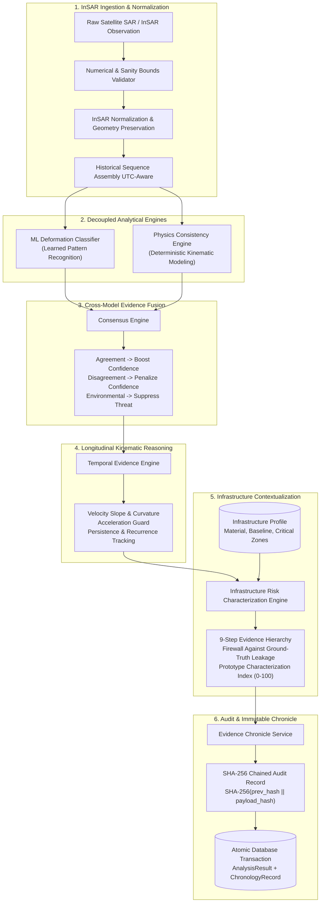

# STRATA — Final System Architecture Specification

**Version**: 1.0.0 (Phase 10 Final Packaging)  
**Status**: ARCHITECTURALLY FROZEN  
**Platform**: Structural Temporal Analysis & Threat Assessment (STRATA)

---

## 1. System Overview & End-to-End Architecture

STRATA analyzes multi-epoch satellite Interferometric Synthetic Aperture Radar (InSAR) observations for civil infrastructure monitoring (bridges, dams, tunnels, retaining walls). The central design principle is that **no single analytical model or single threshold determines structural threat**. Instead, independent analytical models cross-examine the same observable InSAR signals, modifying analytical confidence on agreement or divergence.

### 1.1 Complete Architecture Diagram

---

## 2. Component Specifications

### 2.1 InSAR Observation Validator & Normalization Service
- **Location**: `backend/app/services/insar/normalization.py`
- **Component Version**: `0.1.0`
- **Engine Nature**: Deterministic
- **Input**: Database model `Observation` (containing `deformation_mm`, `los_displacement_mm`, `coherence`, `incidence_angle`, `acquisition_timestamp`).
- **Output**: `InSARNormalizedFeatures` / `NormalizedObservationData`.
- **Purpose**: Verifies numerical finiteness (rejects NaN/Inf), enforces physical bounds (coherence $[0, 1]$, incidence $(0, 90)$, $|d| \le 10,000$ mm), and calculates LOS-to-vertical geometric projection ($\Delta d_{\text{vert}} = \Delta d_{\text{los}} / \cos\theta$).
- **Scientific Assumptions**: Surface displacement is assumed to be predominantly vertical when decomposing single-geometry LOS measurements; satellite look angle is assumed stationary within an acquisition track.
- **Limitations**: Single-track LOS cannot separate true 3D vector deformation (horizontal shear vs vertical subsidence) without multi-track ascending/descending combination. Missing geometry is preserved rather than hallucinated.

---

### 2.2 Machine Learning Deformation Classifier
- **Location**: `backend/app/services/ml/classifier.py`
- **Component Version**: `0.1.0`
- **Engine Nature**: Learned (Statistical Random Forest Classifier, 100 estimators, frozen weights)
- **Input**: `ObservationSequence` (chronological list of normalized observations).
- **Output**: `MLClassificationResult` (predicted class out of 7 ground-truth classes, probability distribution $P(C)$, Shannon entropy, classification confidence).
- **Purpose**: Pure mathematical pattern recognition across extracted statistical, temporal, and frequency-domain features (28 observable InSAR features).
- **Scientific Assumptions**: Feature space distributions learned from controlled synthetic simulations generalize to physical deformation modes.
- **Limitations**: Black-box statistical nature; subject to domain shift when applied to uncalibrated external SAR data; does not understand civil engineering mechanics or structural material limits.

---

### 2.3 Deterministic Physics InSAR Consistency Engine
- **Location**: `backend/app/services/physics/engine.py`
- **Component Version**: `0.2.1`
- **Engine Nature**: Deterministic (Physical and kinematic rule-based)
- **Input**: `ObservationSequence`.
- **Output**: `PhysicsConsistencyEvidence` (classification label, evidence strength, kinematic plausibility factors, environmental factors, atmospheric indicators).
- **Purpose**: Evaluates whether observed phase variations satisfy known radar interferometry constraints: spatial coherence thresholds, phase unwrapping limits, temporal baseline continuity, and environmental correlation.
- **Scientific Assumptions**: Rapid spatial phase jumps below coherence floors indicate decorrelation noise; sinusoidal variations correlated with thermal cycles represent environmental expansion rather than permanent damage.
- **Limitations**: Fixed physical heuristic thresholds may fail to adapt to complex multi-mechanism deformation or highly non-linear geotechnical movement.

---

### 2.4 Cross-Model Consensus Engine
- **Location**: `backend/app/services/consensus/engine.py`
- **Component Version**: `strata_consensus_v0.1.0`
- **Engine Nature**: Deterministic (Evidence fusion and disagreement calculus)
- **Input**: `MLClassificationResult`, `PhysicsConsistencyEvidence`, epoch count.
- **Output**: `ConsensusAssessment` (fused category, confidence score, agreement score, disagreement penalty, analytical explanation, diagnostic flags).
- **Purpose**: Synthesizes the two independent analytical interpretations. Modifies analytical confidence symmetrically:
  $$\text{Agreement} \implies \text{Increased Confidence}$$
  $$\text{Disagreement} \implies \text{Penalized Confidence / Elevated Uncertainty}$$
- **Scientific Assumptions**: Independent analytical engines will rarely produce identical false positives simultaneously.
- **Limitations**: When both models misclassify an out-of-domain signal, rigid consensus can falsely agree or overly suppress genuine deformation (as observed in Phase 8 Case B subsidence).

---

### 2.5 Multi-Epoch Temporal Evidence Engine
- **Location**: `backend/app/services/temporal/engine.py`
- **Component Version**: `strata_temporal_v1_0_0`
- **Engine Nature**: Deterministic (Kinematic time-series state machine)
- **Input**: Historical sequence of observations and consensus evaluations.
- **Output**: `TemporalEvidenceSummary` (temporal status, linear trend velocity, apparent acceleration, `acceleration_supported` boolean flag, persistence score).
- **Purpose**: Evaluates multi-epoch trajectory kinematics. Enforces the **Scientific Acceleration Guard**: mathematically computed acceleration ($\text{mm/yr}^2$) is flagged as unsupported unless observed over sufficient temporal baseline ($\ge 60$ days) and outside nominal baseline noise.
- **Scientific Assumptions**: True structural deformation exhibits directional persistence; isolated single-epoch deviations represent atmospheric turbulence or transient measurement noise.
- **Limitations**: Requires multi-epoch history (minimum 3–5 epochs) to resolve trajectory; cannot characterize instantaneous dynamic shock events.

---

### 2.6 Infrastructure-Specific Risk Characterization Engine
- **Location**: `backend/app/services/risk/engine.py`
- **Component Version**: `strata_risk_v1_0_0`
- **Engine Nature**: Deterministic (Contextual decision hierarchy)
- **Input**: `Infrastructure` asset profile, `TemporalEvidenceSummary`, historical observations.
- **Output**: `RiskCharacterizationRead` (characterization state, continuous prototype index $0-100$, non-alarmist engineering explanation, uncertainty factors).
- **Purpose**: Evaluates the significance of the observed evidence for a specific civil structure, modulated by historical baseline, critical zones, and material type, under a strict **Ground-Truth Leakage Firewall**.
- **Scientific Assumptions**: A 5 mm deformation on an uncharacterized abutment has different operational significance than 5 mm thermal breathing on a steel expansion joint.
- **Limitations**: The continuous index ($0-100$) is an analytical ranking index for inspection prioritization, **NOT** an engineering probability of failure, collapse forecast, or safety certification.

---

### 2.7 Tamper-Evident Chronology Service
- **Location**: `backend/app/services/chronology/service.py`
- **Component Version**: `1.0.0`
- **Engine Nature**: Deterministic (Cryptographic SHA-256 hash chaining)
- **Input**: Database session, observation ID, analytical payload snapshot.
- **Output**: `ChronologyRecord` (record index, payload hash, previous hash, current hash).
- **Purpose**: Constructs an immutable, chronological evidence chain:
  $$\text{Payload Hash} = \text{SHA-256}(\text{CanonicalJSON}(\text{Payload}))$$
  $$\text{Current Hash}_i = \text{SHA-256}(\text{Current Hash}_{i-1} \mathbin{\Vert} \text{Payload Hash}_i)$$
- **Scientific Assumptions**: Cryptographic hash chaining guarantees post-hoc auditability and prevents retrofitting or selective suppression of negative evidence.
- **Limitations**: Protects data integrity in storage; cannot correct corrupted raw radar observations ingested from upstream satellites.
